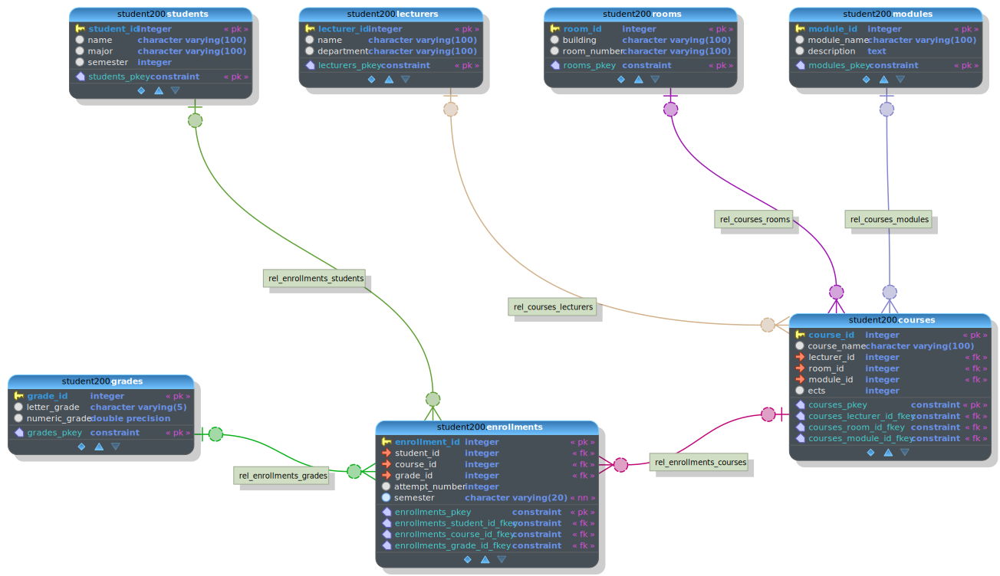

# Bulk Data Import
This is a small demo to illustrate how to load data in bulk into a PostgreSQL database.

Steps to reproduce are:

1. Create the demo schema
2. Create (random) sample data. We will end up with csv-Files that match our schema.
3. Import data into PostgreSQL

## Schema Lectures

## Load Data into PostgreSQL
As always, there are multiple options to import data as bulk.

1. Use a tool to import csv-files directly (e.g., [pgAdmin](https://www.pgadmin.org/) can do that) 
2. Use psql to do it; the [\copy](https://www.postgresql.org/docs/current/app-psql.html#APP-PSQL-META-COMMANDS-COPY) command is your friend.
3. Use a query to do do; similarly to psql, you may use the [`COPY`](https://www.postgresql.org/docs/current/sql-copy.html) statement.
4. Use a tool to convert csv into `INSERT` statements (e.g., [tableconvert](https://tableconvert.com/) can do that)
6. Use any programming language (e.g., Java or Python) and write a short program snippet to do it for you.

## File desciprtions

|File|Description|
|---|---|
|create_data.py|Simple Python script to generate random data|
|create_environment.sh|Bash script to create a Python environment and execute the data generation|
|create_schema.sql|Schema to create a database matching the generated data|
|load_data.py|Simple Python script to load data into a database. Keep in mind that you need to configure your connection.| 
|load_data.sql|Command to load data from psql| 
|model.dbm|ER model that depicts the schema (created with pgmodeler)|
